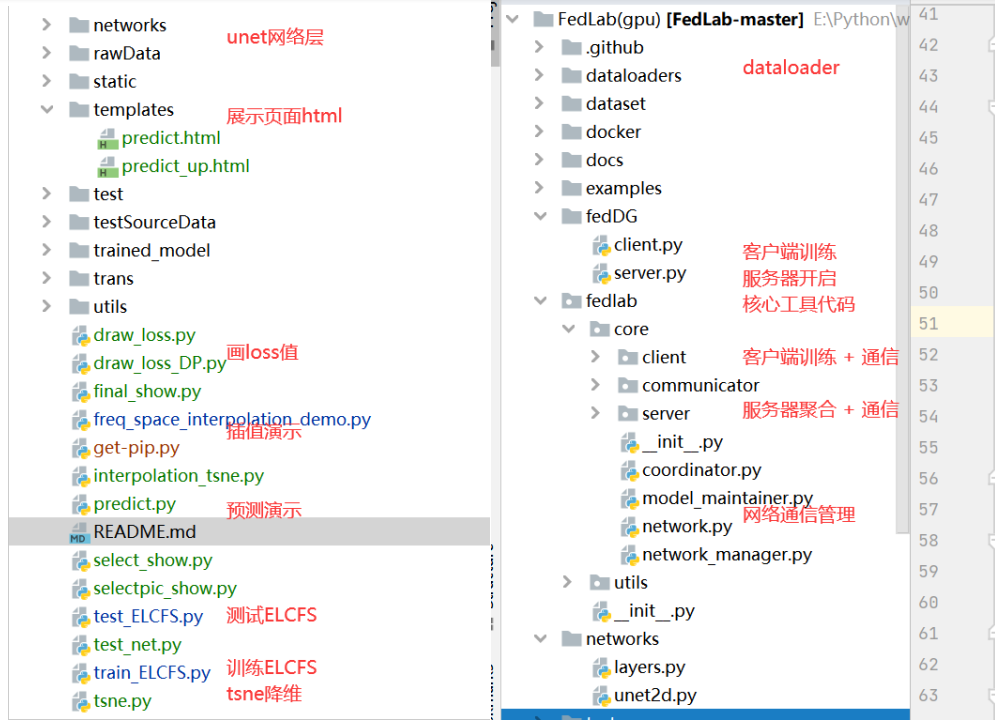
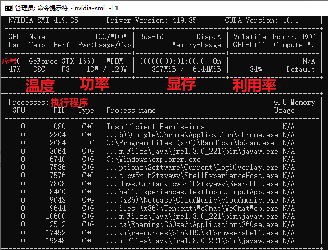

利用Fedlab联邦架构复现FedDG

##### 0.环境版本信息

> python  v 3.9.9
>
> 1.10.1+cpu
>
> **远程训练环境**
>
> 镜像	PyTorch 1.10.0	Python 3.8	Cuda 11.3
>
> GPU	RTX 3090 * 1	显存:24GB
>
> CPU	7核 Intel(R) Xeon(R) CPU E5-2680 v4 @ 2.40GHz	内存:32GB
>
> 默认硬盘	系统盘:20 GB	数据盘:免费:100GB  SSD 付费:0GB
>
> 附加磁盘	无
>
> 端口映射	无
>
> 网络	上行宽带:10MB/s	下行宽带:10MB/s
>
> 费用	￥1.99/时


##### 1.准备数据集

```
训练数据集的格式
├── dataset
      ├── client 1
      	├── data_npy
      		├── sample1.npy, sample2.npy, xxxx  (384 * 384 * 5)
         ├── freq_amp_npy
            	├── amp_sample1.npy, amp_sample2.npy, xxxx
      ├── client xxx
      ├── client xxx    	
```

```
训练内部的测试用client1的数据
├── dataset
     ├── client 1
     	├── data_npy
     		├── sample1.npy, sample2.npy, xxxx  (384 * 384 * 5)
```


```
原始数据的格式   
├──FundusData	(原始图片和掩码标签)
 	├──Domain		
     	├── Domin1
     		├── xxx.jpg
     	├── Dominxxx
 	├──Domain_mask
 		├── Domain1_mask
 			├── xxx.jpg
 		├── Domainxxx_mask   
```

```
从原始数据 到 训练数据  ，产生的中间数据格式
├──midData (中间数据)
    	├──imgData
    		├──client_img1
    			├──img_sample1.npy,img_sample2.npy,XXX  (384 * 384 * 3)
    			├──client_imgxxx
    	├──ampData
    		├──client_amp1
    			├──amp_img_sample1.npy,amp_img_sample2.npy,XXX	(384 * 384 * 3)
    		├──client_ampxxx
    	├──maskData
    		├──client_mask1
    				├──mask_sample1.npy,mask_sample2.npy,XXX (384 * 384 * 3)
    		├──client_maskxxx
```

##### 2.连接远程gpu（xshell）
ssh [root@region-11.autodl.com](mailto:root@region-11.autodl.com) 28427
kAtHGvaobP

ssh root@region-3.seetacloud.com 19563 

##### 3.联邦训练(单机模拟
cd ../../tmp/project

conda activate envFedDG

cd ../FedLab/fedDG

训练命令：
Python train_ELCFS.py

##### 4.联邦训练(1个服务器，3个客户端）
conda activate envFedDG
cd autodl-tmp/Fedlab_gpu/fedDG
训练命令：
python server.py --ip 127.0.0.1 --port 3002 --world_size 4 --round 100
python client.py --ip 127.0.0.1 --port 3002 --world_size 4 --rank 1 --client_idx 1 --dp_mechanism Gaussian
python client.py --ip 127.0.0.1 --port 3002 --world_size 4 --rank 2 --client_idx 2 --dp_mechanism Gaussian
python client.py --ip 127.0.0.1 --port 3002 --world_size 4 --rank 3 --client_idx 3 --dp_mechanism Gaussian

##### 5. 项目目录介绍
（左：单机进程模拟） （右：联邦训练，多节点通信）


##### 杂项

```javascript
升级python 版本
python -V
apt update
apt install python3.8

将原版本的python和python3.8添加到update-alternatives中:
 update-alternatives --install /usr/bin/python3 python3 /usr/bin/python3.6  1
 update-alternatives --install /usr/bin/python3 python3 /usr/bin/python3.8  2
#可以使用 whereis python3 命令在linux中确定python的目录
#上述命令结尾的数字代表优先级, 系统跟据优先级选择默认的python版本

查看所有python
ls /usr/bin/python*
update-alternatives --install /usr/bin/python python /usr/bin/python3.4 2
update-alternatives --list python
update-alternatives --config python
----------------------------------------------------------
python创建虚拟环境
pip install virtualenvwrapper
编辑.bash
export WORKON_HOME=$HOME/.virtualenvs
export VIRTUALENVWRAPPER_PYTHON=/usr/bin/python3
source /usr/local/bin/virtualenvwrapper.sh

mkvirtualenv -p python3 [virutalenv name]
定位某个文件

操作	命令
切换到摸个虚拟环境	workon [virutalenv name]
退出虚拟环境	deactivate
列出所有虚拟环境	lsvirtualenv
删除某个虚拟环境	rmvirtualenv [virutalenv name]
locate .bash*


-----------------------anaconda 虚拟环境-------------------
conda env list
进入指定虚拟环境activate <env_name>
直接pip install <package_name>
查看安装的包：conda list
下面是所需要的包
pip install tqdm
pip3 install torch torchvision torchaudio -i https://pypi.mirrors.ustc.edu.cn/simple/
pip install tensorboardX
conda install tensorboardX
pip install pytorch-metric-learning
pip install SimpleITK
pip install MedPy
pip install matplotlib
pip install h5py
conda install scikit-image (不知道是啥)
pip install scikit-image


依赖配置
conda create -n xxx python=3.8           # 构建一个虚拟环境，名为：xxx
conda init bash && source /root/.bashrc # 更新bashrc中的环境变量
conda activate tf                       # 切换到创建的虚拟环境：tf


```

 >
 >
 >连接远程gpu
 >
 >ssh root@region-11.autodl.com  28427
 >
 >kAtHGvaobP
 >
 >查看cuda 版本 
 >
 >cd /usr/local
 >ls
 >
 >cd ../../root/autodl-tmp
 >
 >conda activate envFedDG
 >
 >cd autodl-tmp/Fedlab_gpu/fedDG
 >
 >

```
pip install -r requirements.txt

端口占用情况
netstat -ano
netstat -ano |findstr "端口号"，然后回车就可以看到这个端口被哪个应用占用
python server.py --ip 127.0.0.1 --port 3002 --world_size 3 --dataset mnist --round 3

python server.py --ip 192.168.43.72 --port 3002 --world_size 3 --dataset mnist --round 3
python client.py --ip 127.0.0.1 --port 3002 --world_size 3 --rank 1 --dataset mnist
（linux）查询Python3进程
ps -ef|grep python3
（windows）
查看进程列表
tasklist | findstr “python”
杀死进程：
taskkill /F /PID 2328

ipconfig

查找所有python进程
ps aux|grep python
```

>TITAN Xp * 1卡
>
>ssh root@region-11.autodl.com 21237
>
>IcYXGqSbrk
>
>```
>python server.py --ip 127.0.0.1 --port 3002 --world_size 3 --dataset mnist --round 3 & python client.py --ip 127.0.0.1 --port 3002 --world_size 3 --rank 1 --dataset mnist & python client.py --ip 127.0.0.1 --port 3002 --world_size 3 --rank 2 --dataset mnist &
>
>
>python server.py --ip 127.0.0.1 --port 3002 --world_size 4 --round 100
>python client.py --ip 127.0.0.1 --port 3002 --world_size 4 --rank 1 --client_idx 1 --dp_mechanism Gaussian
>python client.py --ip 127.0.0.1 --port 3002 --world_size 4 --rank 2 --client_idx 2 --dp_mechanism Gaussian
>python client.py --ip 127.0.0.1 --port 3002 --world_size 4 --rank 3 --client_idx 3 --dp_mechanism Gaussian
>```

> kali 登陆
>
> sudo passwd root
>
> su root
>
> 换源 vim /etc/apt/sources.list
>
> #中科大
> deb http://mirrors.ustc.edu.cn/kali kali-rolling main non-free contrib
> deb-src http://mirrors.ustc.edu.cn/kali kali-rolling main non-free contrib
>
> #阿里云
> deb http://mirrors.aliyun.com/kali kali-rolling main non-free contrib
> deb-src http://mirrors.aliyun.com/kali kali-rolling main non-free contrib
>
> #清华大学
> deb http://mirrors.tuna.tsinghua.edu.cn/kali kali-rolling main contrib non-free
> deb-src https://mirrors.tuna.tsinghua.edu.cn/kali kali-rolling main contrib non-free
>
> #浙大
> deb http://mirrors.zju.edu.cn/kali kali-rolling main contrib non-free
> deb-src http://mirrors.zju.edu.cn/kali kali-rolling main contrib non-free
>
> #东软大学
> deb http://mirrors.neusoft.edu.cn/kali kali-rolling/main non-free contrib
> deb-src http://mirrors.neusoft.edu.cn/kali kali-rolling/main non-free contrib
>
> #官方源
> deb http://http.kali.org/kali kali-rolling main non-free contrib
> deb-src http://http.kali.org/kali kali-rolling main non-free contrib

>conda activate envFedDG
>
>conda deactivate
>
>conda activate envFedlab
>
>cd autodl-tmp/Fedlab_gpu/fedDG/

>
>
>glob 提取文件名
>
>```python
>print('文件名：' + os.path.basename(model_path))
>print('文件后缀：' + os.path.splitext(model_path)[-1])
>print('无后缀的文件名：' + os.path.splitext(os.path.split(model_path)[-1])[0])
>```


```bash
简单查看GPU情况
nvidia-smi
每隔1秒刷新一次
nvidia-smi -l 1
watch -n 1 nvidia-smi
```



